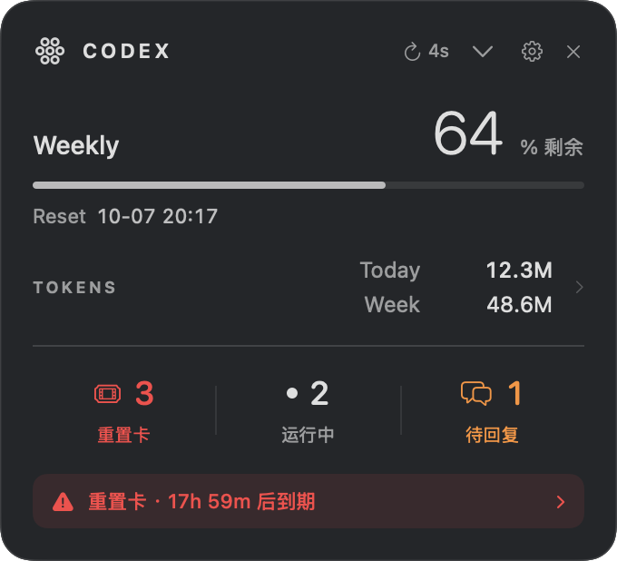
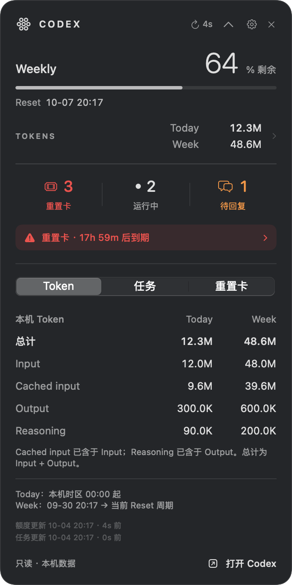
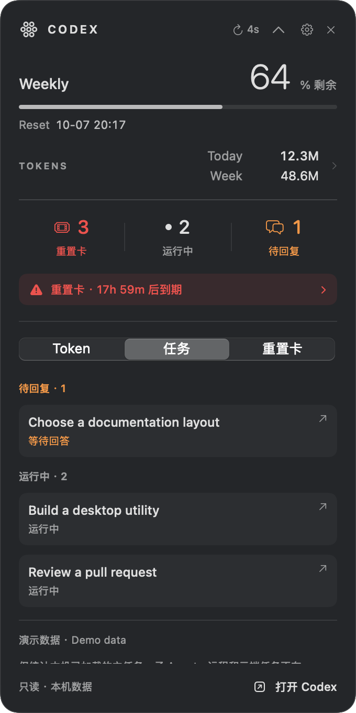
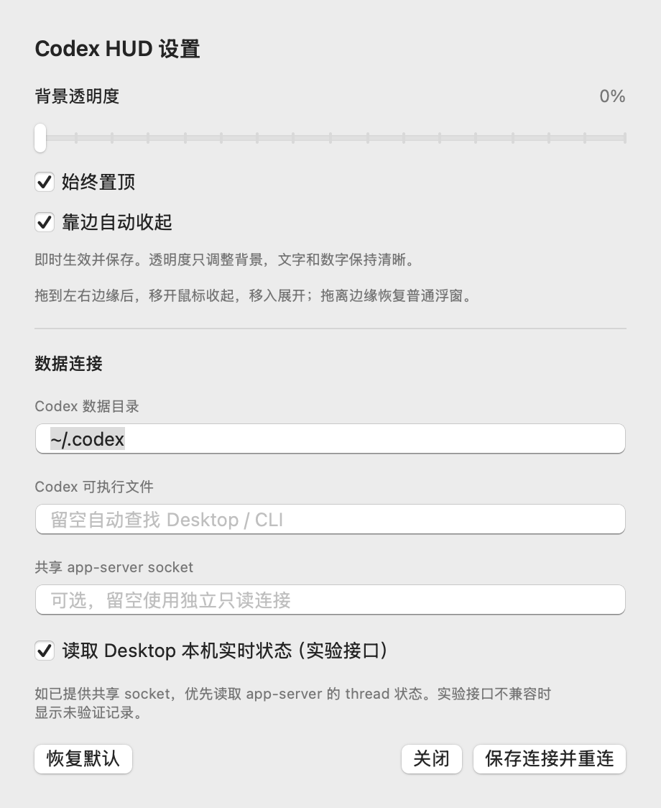
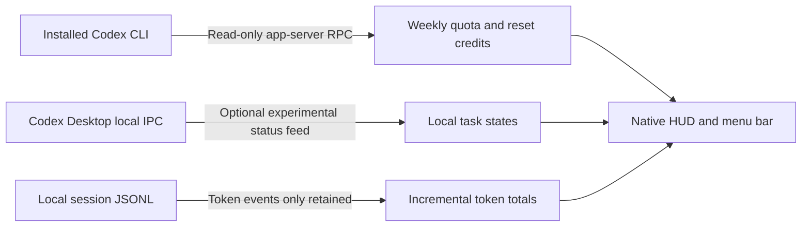

# Codex HUD

**A small, native macOS window for your Codex week.** Weekly quota, local tokens, reset credits and live task status—on your desktop and in the menu bar.

[简体中文](README.zh-CN.md) · [Download](https://github.com/chenlongzhen/codex-hud/releases/latest) · [Security review](SECURITY_REVIEW.md) · [Validation](VALIDATION.md) · [MIT license](LICENSE)

<p align="center">
  
</p>

*The screenshots use synthetic demo data. V1's interface is primarily Simplified Chinese; both English and Chinese guides are provided. This is an independent project, not an official OpenAI application.*

## What it shows

- **Weekly remaining quota and reset time**, with no five-hour progress bar.
- **Today and current Weekly-cycle tokens**, expandable into Input, Cached input, Output and Reasoning.
- **Reset credits and individual expiry dates**: orange within three days, red within 24 hours.
- **Running and waiting chats**, distinguishing waiting for an answer from waiting for approval. Waiting chats are not also counted as running.
- **Freshness and connection problems**: missing or unverified data is not presented as a healthy zero.
- **A desktop HUD and menu-bar summary**, with adjustable background transparency, an always-on-top switch and automatic collapse at either side of the screen.

The HUD does not require a separate API key or access browser cookies. It does not start, resume or stop tasks, approve requests, or consume reset credits.

## Install and start

### Download the app

1. Install Codex Desktop, or a ChatGPT installation that includes Codex, and sign in to Codex.
2. Download `CodexHUD-macOS-arm64.zip` from [Releases](https://github.com/chenlongzhen/codex-hud/releases/latest) and unzip it.
3. Move **Codex HUD.app** to Applications if desired, then open it. The HUD finds a supported installed Codex CLI and uses its existing login.
4. Wait for the first local scan. On the development machine the complete initial snapshot took roughly ten seconds; large histories can take longer.

The downloadable build is for **Apple Silicon**. It uses a local ad-hoc signature and is **not notarized**; macOS may block a downloaded copy. Building locally is an alternative. No automatic updater or login item is installed.

The source targets **macOS 13+** and requires **Swift 6**. Actual testing was on macOS 26.2, Apple Silicon, Swift 6.0.3 and Codex CLI 0.160.0. Other OS versions and Intel builds have not been tested.

### First launch: allow this app

If macOS says the developer cannot be verified or Apple cannot check the app for malicious software, you can usually allow this copy manually after confirming it came from this repository's Releases page:

1. Try opening **Codex HUD.app** once so macOS shows the blocked-app notice.
2. Go to **System Settings → Privacy & Security**, scroll to the security section, and select **Open Anyway** for Codex HUD.
3. Confirm **Open** in the next dialog, completing any authentication macOS requests.

macOS saves an exception for this app, so subsequent launches normally work by double-clicking it. This is an app-specific exception; no global Gatekeeper change is needed. See [Apple's official instructions](https://support.apple.com/102445). Managed Macs may restrict this option. These steps address an unidentified-developer or missing-notarization notice, not a warning that the app is damaged or contains known malware.

### Build from source

Install Xcode or Command Line Tools with a Swift 6 toolchain, then:

```sh
git clone https://github.com/chenlongzhen/codex-hud.git
cd codex-hud
./scripts/check.sh
./scripts/build.sh
open '../Codex HUD.app'
```

No third-party package dependencies are required. The project uses SwiftUI, AppKit, Foundation and the system SQLite library.

To choose a different app destination:

```sh
./scripts/build.sh '/absolute/path/Codex HUD.app'
```

The build script creates the Release executable, icon and app bundle, then verifies its local signature. A narrowly scoped wrapper handles two known partially upgraded Command Line Tools layouts using files under `.build/`; it does not modify the installed toolchain.

## A quick tour

| Control | What to do |
| --- | --- |
| **CODEX** header | Drag here to move the window. |
| **Weekly / Reset** | Read the remaining quota and reset time in your local timezone. |
| **Today / Week** | Click to expand token details for both periods. |
| **重置卡** — reset credits | Click to inspect individual expiry dates, earliest first. |
| **运行中 / 待回复** — running / waiting | Click for task details, then click a task to open it in Codex. |
| Refresh icon | Request a fresh read. |
| Gear icon | Open window and connection settings. |
| **×** | Hide the HUD; it continues running in the menu bar. |
| Menu-bar item | Show/hide the HUD, toggle always-on-top or edge collapse, refresh, open Codex, open settings, or quit. |

<p align="center">
  
  
</p>

### Transparency, window level and edge collapse

Open the gear icon or **设置…** in the menu bar:

- **背景透明度**: 0–80% background transparency. Text stays readable. At 0% the normal dark glass effect remains.
- **始终置顶**: keep the window above ordinary windows, or turn this off for normal window layering.
- **靠边自动收起**: drag the window within 16 points of the left or right edge. Once the pointer leaves, it collapses after about 0.7 seconds into a 36 × 108 point tab. Hover or click to reveal it; drag the expanded header away from the edge to undock it. The top and bottom edges do not trigger collapse.

These changes apply and save immediately, without reconnecting the data sources. Opening settings temporarily prevents collapse.

<p align="center">
  
  
</p>

## Data flow



### Quota and reset credits

The HUD starts its own Codex app-server process and calls the [official `account/rateLimits/read` API](https://learn.chatgpt.com/docs/app-server), requesting reset-credit details. It selects the Codex bucket's 10,080-minute window, whether that window is primary or secondary. It never substitutes the five-hour window or a model reserve bucket.

Quota refreshes every 60 seconds, or every 15 seconds with details open or incomplete credit details. Credit count comes from `availableCount`; expiry comes from each credit. Some responses omit the individual credits. The HUD may show matching-count details from the current run for up to one hour, explicitly marked unverified. Account-change notifications and connection changes clear that cache. Missing dates stay unknown.

### Local tasks and the experimental interface

A separate app-server cannot see Desktop's loaded tasks. V1 therefore enables an optional **local Desktop IPC v11** observer by default. This is an observed, unsupported interface, not a stable public API.

SQLite records and writer locks only discover candidate IDs; live `threadRuntimeStatus` confirms counts. The HUD verifies the local socket owner and connected peer's user ID. It retains task titles and status metadata in memory. IPC snapshots may carry conversation history, which can pass through memory, but the HUD does not save that history.

Counts cover discovered, loaded, unfinished **local main chats**. They exclude subagents, side conversations, remote hosts and cloud tasks. Candidate discovery runs every five seconds, status ownership is checked every 15 seconds, and status becomes invalid after 45 seconds without verification. If the protocol or local indexes change, counts show `—` and an unverified status instead of a fabricated zero. You can disable this feed in settings.

An advanced shared app-server Unix-socket mode uses `thread/loaded/list` and `thread/read` with `includeTurns: false`. It is implemented but has not been tested against a real shared server in this environment.

### Token accounting

The scanner reads `sessions/` and `archived_sessions/` under the configured Codex directory, defaulting to `~/.codex` or `CODEX_HOME`. After the initial scan it reads appended data every 30 seconds.

- **Today** starts at midnight in the Mac's local timezone.
- **Week** starts at the official Weekly reset minus its window duration. It is not a calendar week. Without a valid reset, Week shows `—`.
- **Total = Input + Output**. Cached input is already part of Input; Reasoning is already part of Output.
- Cumulative records become deltas. Duplicate snapshots and copied pre-fork history are excluded; partial lines, replaced files and restarted counters are handled.
- This is local recorded activity, not account billing. Other devices and missing, deleted or unwritten records are outside its coverage. Tokens do not determine the quota percentage.

## Troubleshooting

| Status | Meaning / next step |
| --- | --- |
| `app-server Offline` | Verify Codex login and the CLI path in settings. The HUD retries. |
| `Quota stale` | The read failed, is older than 150 seconds, or the reset has passed. An old value is shown with a warning. |
| `Weekly 暂不可用` | The account response has no supported Weekly window. |
| `任务状态未验证` | Live task status is incomplete, offline or incompatible. Counts are `—`; local unfinished records are only reference information. |
| `Token 数据不完整` / `Token stale` | A local read/format problem, out-of-range data, or a snapshot older than 90 seconds. |
| Credit details unverified | Count is known but dates are missing, incomplete or cached. Refresh and allow time for another response. |

Connection settings support a Codex data directory, a trusted local CLI executable, an optional shared socket and the experimental-feed switch. An explicitly invalid CLI path fails visibly instead of silently choosing another executable.

Preferences are stored in `~/Library/Application Support/Codex HUD/settings.json`; window position uses macOS user defaults. Do not publish your preferences, live diagnostics, sessions or screenshots containing personal task titles.

## Development and checks

```sh
# Behavioral regression checks: no account required
./scripts/check.sh

# Read a live diagnostic snapshot (contains real usage; review before sharing)
'../Codex HUD.app/Contents/MacOS/CodexHUD' --diagnose

# Exercise native window geometry/layering and render to a local folder
'../Codex HUD.app/Contents/MacOS/CodexHUD' --check-window /tmp/codex-hud-window-check

# Recreate documentation screenshots with synthetic data, without connecting
'../Codex HUD.app/Contents/MacOS/CodexHUD' --demo /tmp/codex-hud-demo
```

The diagnostic command waits up to 45 seconds. Exit 0 means its checked data sources and credit details were available; exit 2 means at least one was incomplete. It omits account IDs, task titles, message text and credentials, but **still contains private usage and timing data**.

Native window checks do not synthesize mouse input and do not replace a manual interaction pass. See [VALIDATION.md](VALIDATION.md) for exact coverage and remaining gaps, and [SECURITY_REVIEW.md](SECURITY_REVIEW.md) for the review scope and fixes.

```text
Sources/HUDCore/       Read-only connections, status, tokens and preferences
Sources/CodexHUD/      SwiftUI HUD, AppKit window/menu, settings and diagnostics
Sources/CSQLite/       System SQLite bridge
Tests/HUDCoreTests/    Behavioral checks and temporary-file fixtures
scripts/              Build and check helpers
```

## License

[MIT](LICENSE).
