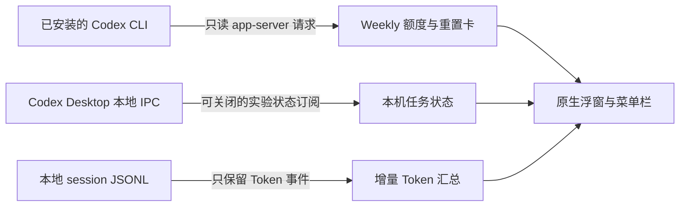

# Codex HUD

**放在桌面一角的 macOS 原生 Codex 用量浮窗。** 一眼查看 Weekly 额度、本机 Token、重置卡到期时间和任务状态，同时提供菜单栏摘要。

[English](README.md) · [下载应用](https://github.com/chenlongzhen/codex-hud/releases/latest) · [安全审查](SECURITY_REVIEW.md) · [验收记录](VALIDATION.md) · [MIT 许可证](LICENSE)

<p align="center">
  
</p>

*图中均为演示数据，不是作者的真实账户信息。V1 界面以简体中文为主，提供中英文使用文档。这是独立社区项目，并非 OpenAI 官方应用。*

## 能看什么

- **Weekly 剩余额度与 Reset 时间**，不显示 5h 进度。
- **Today 和当前 Weekly 周期的 Token**，点击可展开 Input、Cached input、Output、Reasoning。
- **重置卡数量及逐卡到期日**：距到期不超过三天显示橙色，不超过 24 小时显示红色。
- **运行中和待回复任务**，区分等待回答与等待批准，待回复不会重复计入运行中。
- **数据新鲜度与异常状态**，未知或未验证的数据不会显示成正常的零。
- **桌面浮窗与菜单栏摘要**，支持背景透明度、始终置顶开关和左右靠边自动收起。

无需额外 API Key，不读取浏览器 Cookie。程序不会发起、恢复或终止任务，不会回答审批，也不会消耗重置卡。

## 安装与启动

### 下载应用

1. 安装 Codex Desktop，或包含 Codex 的 ChatGPT，并先登录 Codex。
2. 从 [Releases](https://github.com/chenlongzhen/codex-hud/releases/latest) 下载 `CodexHUD-macOS-arm64.zip` 并解压。
3. 可将 **Codex HUD.app** 拖入“应用程序”，然后打开。HUD 会寻找受支持的已安装 Codex CLI，使用它已有的登录状态。
4. 等待第一次本地扫描。本次开发机器取得完整初始快照约需十秒；历史记录较多时可能更久。

下载版适用于 **Apple Silicon**，使用本地 ad-hoc 签名，**没有开发者公证**，macOS 可能拦截下载的应用。也可以选择从源码在本机构建。程序不会自动安装更新器或添加登录启动项。

源码目标为 **macOS 13+**，构建需要 **Swift 6**。实际验收环境为 macOS 26.2、Apple Silicon、Swift 6.0.3 和 Codex CLI 0.160.0。其他系统版本及 Intel 构建尚未实机验证。

### 从源码构建

安装包含 Swift 6 的 Xcode 或 Command Line Tools，然后执行：

```sh
git clone https://github.com/chenlongzhen/codex-hud.git
cd codex-hud
./scripts/check.sh
./scripts/build.sh
open '../Codex HUD.app'
```

无需第三方包，仅使用系统 SwiftUI、AppKit、Foundation 和 SQLite。

也可指定应用输出位置：

```sh
./scripts/build.sh '/absolute/path/Codex HUD.app'
```

脚本生成 Release 可执行文件、图标和 `.app`，并校验本地签名。针对两种已知的 Command Line Tools 升级残留布局，构建包装脚本只在 `.build/` 中使用局部副本或覆盖，不修改系统工具链。

## 第一次使用

| 位置或按钮 | 操作与含义 |
| --- | --- |
| 左上角 **CODEX** | 按住这里拖动浮窗。 |
| **Weekly / Reset** | 查看剩余额度，Reset 按本机时区显示。 |
| **Today / Week** | 点击展开两个周期的 Token 明细。 |
| **重置卡** | 点击查看每张卡的到期日，最近到期的排在最前。 |
| **运行中 / 待回复** | 点击查看任务；再次点击某条任务可打开对应 Codex 聊天。 |
| 刷新图标 | 立即重新读取数据。 |
| 齿轮图标 | 打开浮窗和连接设置。 |
| **×** | 隐藏浮窗，菜单栏继续运行。 |
| 菜单栏摘要 | 显示/隐藏浮窗，切换置顶或靠边收起，刷新、打开 Codex、进入设置或退出。 |

<p align="center">
  
  
</p>

### 调透明度、置顶和靠边收起

点击齿轮，或菜单栏中的 **设置…**：

- **背景透明度**：范围 0%–80%，只调整背景，文字和数字保持可读。0% 保留默认深色毛玻璃效果。
- **始终置顶**：开启时显示在普通窗口上方，关闭后采用普通窗口层级。
- **靠边自动收起**：拖到屏幕左/右边缘 16 pt 内，鼠标移开约 0.7 秒后收成 36 × 108 pt 窄标签。鼠标移入或点击标签展开；展开后拖动 CODEX 标识离开边缘，即恢复普通浮窗。顶部和底部不触发自动收起。

这三项设置即时生效并自动保存，不会重启数据连接。打开设置窗口时暂不自动收起。

<p align="center">
  
  
</p>

## 数据怎么来



### 账户额度和重置卡

HUD 启动自己使用的 Codex app-server，通过 [官方 `account/rateLimits/read` 接口](https://learn.chatgpt.com/docs/app-server) 请求额度与逐卡明细。它选择 Codex 额度桶中时长为 10,080 分钟的窗口，无论该窗口位于 primary 还是 secondary；不会用 5h 或模型备用额度代替 Weekly。

账户数据常态每 60 秒刷新，展开详情或卡片明细不完整时每 15 秒刷新。卡片数量来自 `availableCount`，到期日来自逐卡明细。部分接口响应可能只给数量，不给卡片：HUD 可在本次运行期间、数量相同时，显示最多一小时内的上次明细，并明确标为未验证。账户变更通知或修改连接设置会清空缓存。缺失的到期时间不会被编造。

### 本机任务与实验接口

独立启动的 app-server 看不到 Desktop 已加载的任务。因此 V1 默认开启可关闭的 **Desktop 本地 IPC v11** 状态订阅。这是观察到的实验接口，不是稳定公开 API。

SQLite 未结束记录和 writer lock 只用于发现候选任务，最终计数须由实时 `threadRuntimeStatus` 确认。HUD 检查本地 socket 文件所有者及连接对端的用户身份，在内存中保留任务标题和状态。IPC 快照可能附带对话历史并经过内存，但 HUD 不保存这些历史正文。

计数覆盖发现到的、已加载且未结束的**本机主任务**，不含子 Agent、side conversation、远程主机和云端任务。每五秒发现候选任务，每 15 秒验证状态所有者，超过 45 秒未验证则失效。协议或本地索引发生变化时，显示“任务状态未验证”和 `—`，不会假装正常空闲。可在设置中关闭实验接口。

高级共享 app-server Unix socket 模式使用 `thread/loaded/list` 和 `thread/read`，明确传入 `includeTurns: false`。该模式已实现，但本环境没有可用共享服务，尚未做真实端到端验收。

### Token 统计口径

读取所配置 Codex 目录中的 `sessions/` 与 `archived_sessions/`。默认使用 `~/.codex`，也尊重 `CODEX_HOME`。首次扫描后，每 30 秒按文件偏移读取新增记录。

- **Today**：本机时区 00:00 至统计时刻。
- **Week**：官方 Weekly reset 减去窗口时长，至统计时刻；不是自然周。没有有效 Reset 时显示 `—`。
- **总计 = Input + Output**。Cached input 已包含在 Input 中，Reasoning 已包含在 Output 中，不重复相加。
- 累计快照转成增量，排除重复快照和 fork 复制的早期历史，并处理追加半行、文件替换及累计计数重启。
- 这是本机可读记录统计，不是账户账单。其他设备及缺失、删除、尚未落盘的数据不在覆盖内，Token 数也不用于反推账户剩余额度。

## 遇到异常时

| 显示 | 含义及处理 |
| --- | --- |
| `app-server Offline` | 检查 Codex 登录与设置中的 CLI 路径，程序会重试。 |
| `Quota stale` | 读取失败、超过 150 秒未更新或已经跨过 Reset；旧值会带警告显示。 |
| `Weekly 暂不可用` | 账户响应没有受支持的 Weekly 窗口。 |
| `任务状态未验证` | 实时状态不完整、离线或协议不兼容；计数为 `—`，本地未结束记录仅供参考。 |
| `Token 数据不完整` / `Token stale` | 本地读取/格式异常、数值超出支持范围，或超过 90 秒未更新。 |
| 重置卡明细未验证 | 已知数量，但日期缺失、不完整或来自缓存；刷新后等待接口重试。 |

连接设置支持 Codex 数据目录、受信任的本地 CLI 可执行文件、共享 socket 和实验接口开关。显式指定无效 CLI 路径时会报错，不悄悄改用其他程序。

偏好保存在 `~/Library/Application Support/Codex HUD/settings.json`，窗口位置使用 macOS 用户默认设置。不要公开自己的偏好文件、真实诊断输出、sessions 或包含私人任务标题的截图。

## 开发与验证

```sh
# 行为回归检查，不需要账户
./scripts/check.sh

# 读取真实诊断快照，包含个人用量，分享前需自行检查
'../Codex HUD.app/Contents/MacOS/CodexHUD' --diagnose

# 检查真实窗口的层级、位置和渲染，输出到本地目录
'../Codex HUD.app/Contents/MacOS/CodexHUD' --check-window /tmp/codex-hud-window-check

# 使用虚构数据生成文档截图，不连接账户
'../Codex HUD.app/Contents/MacOS/CodexHUD' --demo /tmp/codex-hud-demo
```

诊断最多等待 45 秒，检查的数据源和完整卡片明细可用时返回 0，否则返回 2。输出不含账户 ID、任务标题、消息正文或凭据，但**仍含个人用量和时间信息**。

原生窗口检查不会合成鼠标输入，也不能代替人工交互验收。具体覆盖与缺口见 [VALIDATION.md](VALIDATION.md)，安全审查范围与修复见 [SECURITY_REVIEW.md](SECURITY_REVIEW.md)。

```text
Sources/HUDCore/       只读连接、状态、Token 与偏好
Sources/CodexHUD/      SwiftUI 浮窗、AppKit 窗口/菜单、设置与诊断
Sources/CSQLite/       系统 SQLite 桥接
Tests/HUDCoreTests/    行为检查及临时文件用例
scripts/              构建与检查脚本
```

## 许可证

[MIT](LICENSE)。
